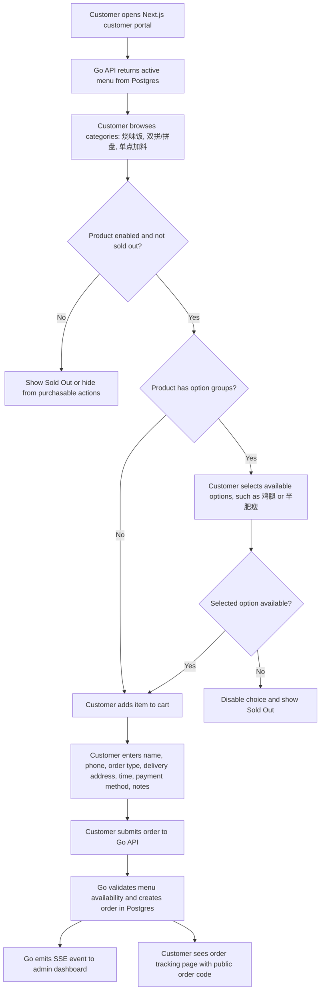
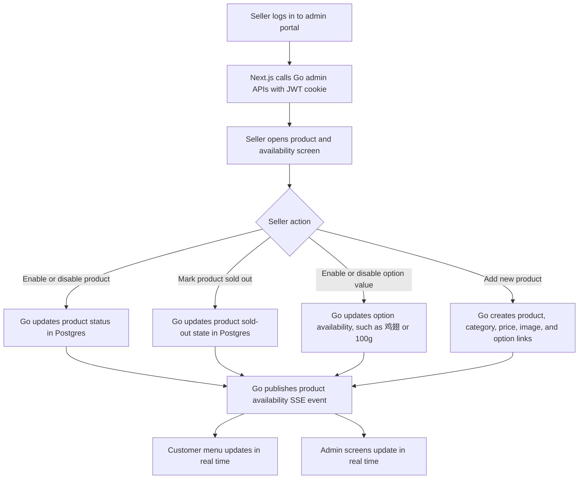
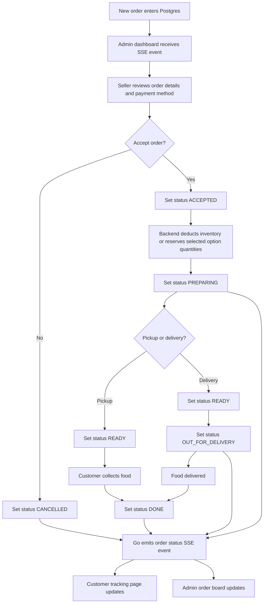
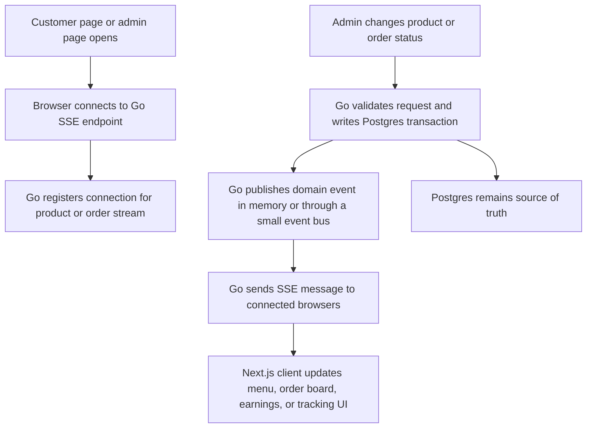
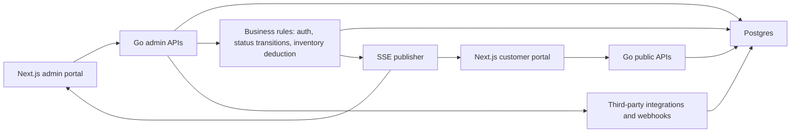

# Roast by Jaden Admin Platform Flow

## Purpose

This file is an agent-facing handoff reference for future Roast by Jaden platform work. Read it before planning or implementing customer ordering, seller admin, product availability, delivery tracking, real-time updates, or backend/database features.

The project should evolve from the current static ordering site into a mobile-responsive food delivery and ordering platform for 香港烧腊饭. Preserve the existing customer ordering flow while migrating incrementally.

## Current State

- The current customer site is static: `index.html`, `styles.css`, and `app.js`.
- Menu data, prices, categories, images, and sold-out option data are hardcoded in `app.js`.
- Checkout currently builds a WhatsApp message and opens `wa.me`; WhatsApp is not the future source of truth for orders.
- The current menu categories are:
  - `烧味饭`
  - `双拼/拼盘`
  - `单点加料`
- The current option groups are:
  - `鸡肉部位`: `鸡胸`, `鸡二度`, `鸡翅`, `鸡腿`
  - `叉烧肥瘦`: `瘦`, `半肥瘦`
  - `重量`: `100g`, `200g`
  - `烧鸭规格`: `一例`, `半只`, `一只`

Future work must treat both products and option values as availability-controlled records. For example, a whole item can be disabled, and a specific choice like `鸡腿` or `半肥瘦` can also be sold out.

## Target Stack

- Frontend: Next.js
  - Customer ordering portal
  - Mobile responsive web app or PWA
  - Seller admin portal
  - Customer order status page
  - Real-time customer and admin UI updates
- Backend: Go
  - Admin login and protected APIs
  - Menu, product, inventory, and order APIs
  - Food preparation and delivery status control
  - Server-Sent Events for real-time updates
  - Third-party API integrations and webhook handlers
  - Business rules and background jobs
- Database: Supabase Postgres or plain Postgres
  - Products and menu options
  - Inventory and sold-out state
  - Orders and order items
  - Customer details
  - Delivery tracking state
  - Admin users and permissions
  - Order status history

## Chosen Defaults

- Migration path: Platform MVP.
- Real-time strategy: Go Server-Sent Events.
- Admin auth: Go JWT login with secure HTTP-only cookies.
- Delivery tracking v1: manual seller-controlled statuses.
- Admin UI language: bilingual, with English operational labels and Chinese product names preserved.

## Target Admin Features

- Seller login.
- Enable, disable, or mark a product as sold out.
- Enable or disable option-level availability, such as roast meat parts and portion choices.
- Add new products to the customer portal.
- Show total earning of the day.
- Control order and food status:
  - `NEW`
  - `ACCEPTED`
  - `PREPARING`
  - `READY`
  - `OUT_FOR_DELIVERY`
  - `DONE`
  - `CANCELLED`

## Customer Ordering Flow

## Admin Product And Inventory Flow

## Admin Order Status Flow

## Go SSE Real-Time Update Flow

Use Go API writes as the primary event source. If future tools update Postgres outside the Go API, add Postgres `LISTEN/NOTIFY` or a lightweight polling worker so Go can still publish SSE events.

## Suggested Backend And Database Flow

Suggested records:

- `admin_users`: seller/admin identity, password hash, role, active state.
- `products`: menu item name, category, description, price, image, enabled state, sold-out state.
- `product_option_groups`: reusable groups such as `鸡肉部位`, `叉烧肥瘦`, `重量`, `烧鸭规格`.
- `product_option_values`: option labels, optional override price, availability, sort order.
- `product_option_links`: product-to-option-group mapping.
- `orders`: customer details, order type, delivery address, payment method, total, current status, public tracking code.
- `order_items`: ordered product snapshot, selected options snapshot, unit price, quantity.
- `order_status_events`: status history, actor, timestamp, optional note.
- `inventory_adjustments`: optional future stock history for roast parts and product availability.

## Implementation Notes For Future Agents

- Keep API keys, webhook secrets, payment credentials, delivery credentials, and WhatsApp credentials out of the frontend.
- Put third-party integration logic in the Go backend.
- Keep frontend components focused on display and user interaction.
- Keep business rules in Go, especially inventory deduction, product availability checks, order status transitions, earnings calculations, and delivery state mapping.
- Preserve the existing ordering flow while migrating: menu browsing, cart, customer details, pickup or delivery time, payment method, and notes should still feel familiar.
- Use Go SSE as the chosen real-time strategy for customer tracking, admin order updates, earnings refreshes, and product sold-out updates.
- Treat Postgres as the source of truth. WhatsApp can remain as an optional notification channel, but not the canonical order store.
- Calculate today's earnings using Asia/Kuala_Lumpur business-day boundaries.
- Default earnings calculation should include `ACCEPTED`, `PREPARING`, `READY`, `OUT_FOR_DELIVERY`, and `DONE`; exclude `NEW` and `CANCELLED`.

## Suggested Add-On Features

- Low-stock alerts for popular roast parts.
- Pause ordering toggle for closing early.
- Time-slot capacity limits to avoid too many orders in one pickup or delivery window.
- WhatsApp notification from Go backend after order submission or status changes.
- Customer order tracking link after checkout.
- Daily sales breakdown by product.
- Kitchen screen focused only on active preparation orders.
- Admin audit log for product and status changes.
